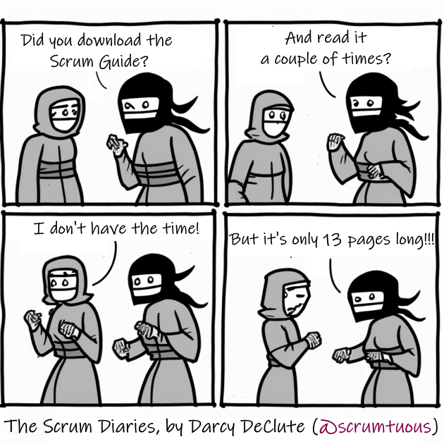
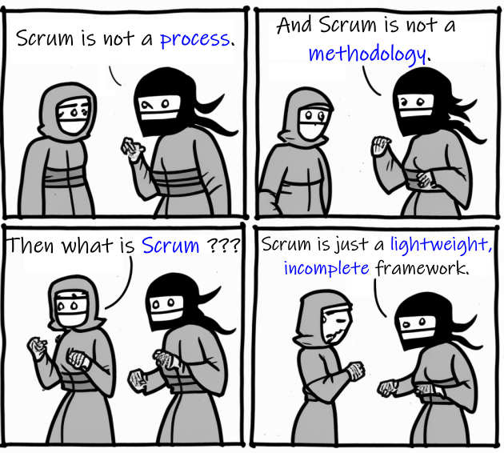

== Getting Started

I'm going to get you Scrum Certified. I hope you're ready.

In the process we're going to:

- Go through the whole 2020 Scrum Guide, one line at a time
- Extract as much meaning as possible out of the Scrum Guide's words
- Discuss how ideas in the Scrum Guide translate into exam questions
- Iteratively and incrementally test you on what you've learned

When you're finished this book, my goal is for you to be 100% ready to schedule and pass the Scrum Certification exam.

=== The Best Ways to Learn

Before you read too far ahead, let me recommend that you download and print out a couple of copies of the 2020 Scrum Guide.

The Guide is only 13 pages long, and that includes the cover page, introduction and the table of contents. You won't be destroying a forest by having a couple of printed copies by your side.

Grab a marker and a highlighter as well and markup that printed copy of the Scrum Guide as we go along. It will seriously help you learn.

.Try to hit as many learning modalities as you can.

There are many different 'learning modalities' that help people learn.

- Reading a book is one modality. 
- Watching videos online is popular too.
- Attending lectures is proven learning modality. 
- The tactile experience of putting pen to paper is another. 

Try and stimulate your learning in as many ways as you can.

<<<

=== Before We Begin

There is one required prerequisite before you dig into this book.

For this book to make sense, you must have read the 13 page 2020 Scrum Guide at least once.

This book is designed to give you a deeper understanding of the topics covered in the Scrum Guide, with the eventual goal of helping you get Scrum Certified.

However, this book assumes you have read the 2020 Scrum Guide at least once, hopefully twice.

.Try to hit as many learning modalities as you can.

This book assumes you know the basic idea behind who a Scrum Master is, what a Product Backlog is and the idea behind the Definition of Done. 

We will often reference terms like the 'Increment' or the 'Product Goal' because it is assumed that you have read the Scrum Guide at least once and have some fundamental understanding of these concepts.

But once you've given the 2020 Scrum Guide a read or two, you're ready to jump into this Scrum Certification guide and get yourself on the path to career advancement.

Now let's get started with the Scrum Guide!

=== What is Scrum?

How would you define Scrum?

To be successful on the Scrum Master Certification exam you have to commit to the Scrum Guide's definition of Scrum, which means abandoning many biases and misconceptions you may have adopted over years of hearing people talk about Scrum or seeing Scrum implemented in a less than pure manner.

Here's the 2020 Scrum Guide's first sentence. How well does this definition of Scrum work with the way you previously perceived it. (And I say 'previously', because this is the definition you must commit to if you want to pass the Scrum Certification exam.)

[quote, 2020 Scrum Guide page 3]
____
Scrum is a lightweight framework that helps people, teams and organizations generate value through adaptive solutions for complex problems. 
____

Given what you know about Scrum, and taking into account any experiences you've had with Scrum, how would you rate this definition?

.The Scrum Framework provides a powerful strategy for product development. Just don't call it a process or methodology!
image::images/scrum-incomplete.png
 

[quote, 2020 Scrum Guide page 3]

=== The Definition of Scrum

Whoever crafted that definition tried to make it as general and all-encompassing as possible, almost to the point where the definition doesn't provide much value.

- The term 'generate value' is very generic
- The term 'complex problems' could apply to anything
- The term 'adaptive solutions' sounds like marketing gibberish

But this is the definition we have, and this is the definition you will be tested on.

A couple of things to notice about the official definition of Scrum:

- The definition never mentions software development
- The definition calls Scrum a framework, not a process or methodology

Given that definition of Scrum, how would you answer the following  question?

'''

==== Test Yourself

****
True or False: Scrum is a proven software development process.

* [ ] True
* [ ] False

****

The answer is false.

Scrum is not a process, nor does it specifically target software development.

You'll get beaten with a stick if any of the Scrum gatekeepers ever hear you call Scrum a process or a methodology. Scrum is a lightweight, incomplete framework. 

- Scrum is not a process.
- Scrum it is not a methodology.
- Scrum is purposefully incomplete.

'''

=== Scrum is a Framework

Feel free to debate whether you believe Scrum is a process or a methodology on Twitter or in your favorite online forum. I know I have.

On the Scrum Certification exam? Scrum is a framework.

The stewards of the Scrum framework have also worked hard to position Scrum as a tool that can be applied in a variety of industries, not just software development. 

If you ever see an option on the certification exam that asserts Scrum works exclusively in the domain of software development, avoid it, because it's wrong.

'''

==== Test Yourself

Here's the type of trick question you'll see on the Scrum certification exam that attempts to trip you up on the incorrectly held belief that Scrum is only used in software development:

****
True or False: Scrum is a lightweight framework used exclusively by software development teams to generate value through adaptive solutions to complex problems. 
****

The answer is false because the question implies that Scrum is only applicable in the world of software development. 

There is a big push in the Scrum community to gain acceptance outside of software development. Any certification questions that pigeonholes Scrum into a software development box will be wrong.

'''

==== Test Yourself

****

Which of the following statements most accurately reflects the definition of Scrum?

* [ ] Scrum is a software development methodology
* [ ] Scrum is an Agile process for teams and organizations to following
* [ ] Scrum is a lightweight framework to help teams tackle complex problems
* [ ] Scrum is a lightweight framework to help teams and organizations build software

****

Option C is correct. 

The Guide very vaguely describes Scrum as a "lightweight framework that helps people, teams and organizations generate value through adaptive solutions for complex problems." 

Any references to Scrum being a methodology, a process or a framework the targets software development will always be a wrong answer on the Scrum Certification exam.

'''

=== Iterative and Incremental

According to the Guide, here's a high level overview of how Scrum is supposed to work.

[quote, 2020 Scrum Guide page 3]
____
In a nutshell, Scrum requires a Scrum Master to foster an environment where:

. A Product Owner orders the work for a complex problem into a Product Backlog.
. The Scrum Team turns a selection of the work into an Increment of value during a Sprint.
. The Scrum Team and its stakeholders inspect the results and adjust for the next Sprint.
. Repeat
____

The name 'Scrum Master' sounds intimidating.

People think that since the term 'master' is in the name, the Scrum Master controls everything.

The Scrum Master controls very little. Their only real job is to coach people on how Scrum works, or as this paragraph states, 'foster an environment' where this iterative set of steps are performed.

==== Test Yourself

****
Which of the following descriptions are true?

* [ ] Scrum describes an iterative process
* [ ] Scrum is an iterative framework
* [ ] Scrum generates value by repeatedly delivering usable increments to the stakeholders
* [ ] Scrum only allows stakeholders to inspect progress when the final product is delivered
****

Scrum definitely describes a set of steps that are to be repeated iteratively. So Scrum is iterative. But it's an iterative framework, not an iterative process. So option B is correct while Option A isn't.

Scrum it an incremental framework, which means it constantly tries to deliver something tangible and of value to the client at the end of every sprint. That way the stakeholders can regularly give feedback. If there's an issue, the Scrum team can then adapt.

That's in stark contrast to what is known as the Waterfall model where the client gets a complete product at the end of development. So option C is correct while Option D is wrong.

'''

<<<

=== Scrum is Simple

Many people overthink things in Scrum. 

People think there are a bunch of rules they have to follow if they want to use Scrum.

The fact is, there are very few rules in Scrum. The brevity of the Scrum Guide is proof of that.

Scrum is pretty simple, and when problems arise, it's pretty pragmatic too.

[quote, 2020 Scrum Guide page 3]
____
Scrum is simple. 

Try it as is and determine if its philosophy, theory, and structure help to achieve goals and create value. 

The Scrum framework is purposefully incomplete, only defining the parts required to implement Scrum theory. 

Scrum is built upon by the collective intelligence of the people using it. 

Rather than provide people with detailed instructions, the rules of Scrum guide their relationships and interactions.
____

.Scrum is a lightweight, incomplete framework that helps teams generate value as they work towards a Product Goal.
[Sunset,600,600] 

<<<

=== It's a Guide, not an Instruction Manual

People often look to the Scrum Guide for definitive answers on things. The Scrum Guide doesn't contain many definitive answers.

It's a guide, not a rulebook.

The Scrum Guide even promises __not__ to be heavy on rules in this paragraph, saying that it promises not to 'provide people with detailed instructions.'

There are very few actual rules in the 13 page Scrum Guide.

Outside of the few rules Scrum actually has, the framework encourages people to discover strategies that work best for them.

==== Test Yourself

****
True or False: Scrum is a complete and proven framework that helps teams achieve goals and create value.
****

This is false. 

Scrum self-identifies as an incomplete framework.

This fact seems counter-intuitive to many. After all, 

- Why would anyone want to use an incomplete framework? 
- Wouldn't a complete framework be better?

The incomplete nature of Scrum is actually what makes it so attractive. Scrum provides only enough direction to useful, but not so much direction that it is restrictive. Scrum teams are given all the leeway they need to find the processes and frameworks that work best for them.

'''

=== Exposing Efficacy 

One of the funny things about Scrum is that because it's so simple, it can really expose practices and processes that are wasteful and non-productive. It also allows developers to focus on the practices that make them most productive.

[quote, 2020 Scrum Guide page 3]
____
Various processes, techniques and methods can be employed within the framework. 

Scrum wraps around existing practices or renders them unnecessary. 

Scrum makes visible the relative efficacy of current management, environment, and work techniques, so that improvements can be made.
____

Since Scrum is a framework, not a process, other processes can be used within it.

=== Combine the Scrum Framework with other Processes

For example, people often think Kanban is a competitor to Scrum, but there is nothing that says Scrum and Kanban can't be used together.

If you're not familiar with Kanban, don't worry. Kanban is never mentioned in the Scrum Guide and it will never be a 'correct answer' on the Scrum certification exam.

==== Test Yourself

****
True or false: Scrum can be used alongside various processes and methodologies including Kanban and Lean.
****

This is true.

Scrum is not a process nor is it a methodology, and because of that, it can be used in conjunction with a variety of popular methodologies like Kanban and Lean.

The Scrum Certification Exam will not test you on the intricacies of Lean Manufacturing or Kanban. It's sufficient just to know that these are two processes commonly used in manufacturing and software development.

'''

****
True or False: When implemented properly, Scrum will expose ineffective management techniques that may not have anything to do with software development.

****

First of all, Scrum is not just about software development.

The people who oversee the Scrum framework are pushing hard to have Scrum used in all areas of industry and manufacturing. To be successful on the Scrum certification exam, get the idea out of your head that Scrum is just about software development. It's not.

And secondly, the iterative and incremental nature of Scrum, where there is constant inspection and adaptation is supposed to shine a light on practices external to Scrum that may be ineffective. That's what the Scrum Guide means when it says "Scrum makes visible the relative efficacy of current management, environment, and work techniques, so that improvements can be made."

We're done with the definition of Scrum. Now on for a little overview of what Scrum Theory is and what it's based on.

'''

TIP: Scrum is not just for software development. It can be used in industry, manufacturing, construction and even bee keeping. Sometimes, to really understand Scrum, frame it an industry other than software development.

