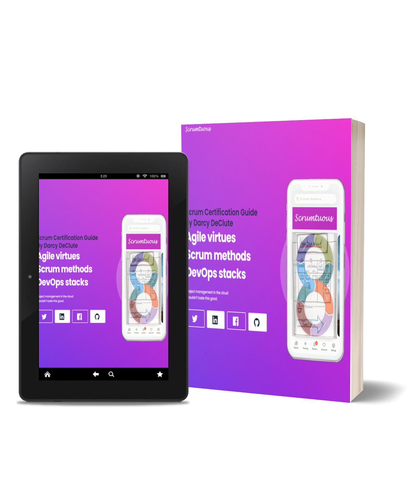

= Scrum Certification Guide

<<<

include::01A-definition-of-scrum.adoc[]

<<<

include::02A-scrum-theory.adoc[]

<<<

include::03A-scrum-pillars-and-values.adoc[]

<<<

include::04A-scrum-team.adoc[]

<<<

include::05A-developers.adoc[]

<<<

include::06A-product-owner.adoc[]

<<<

include::07A-scrum-master.adoc[]

<<<

include::08A-scrum-events.adoc[]

<<<

include::09A-the-sprint.adoc[]

<<<

include::10A-sprint-planning.adoc[]

<<<

include::11A-daily-scrum.adoc[]

<<<

include::12A-sprint-review.adoc[]

<<<

include::13A-sprint-retrospective.adoc[]

<<<

include::14A-scrum-artifacts.adoc[]

<<<

include::15A-product-backlog.adoc[]

<<<

include::16A-sprint-backlog.adoc[]

<<<

include::17A-increment.adoc[]

<<<

include::focused/fq-artifacts.adoc[]

<<<

include::focused/fq-coaching.adoc[]

<<<

include::focused/fq-definition-of-done.adoc[]

<<<

include::focused/fq-empiricism.adoc[]

<<<

include::focused/fq-events.adoc[]

<<<

include::focused/fq-facilitation.adoc[]

<<<

include::focused/fq-forecasting-and-releases.adoc[]

<<<

include::focused/fq-product-backlog.adoc[]

<<<

include::focused/fq-product-value.adoc[]

<<<

include::focused/fq-scrum-team.adoc[]

<<<

include::focused/fq-self-management.adoc[]

<<<

include::focused/fq-stakeholders.adoc[]

<<<

include::focused/fq-stakeholders.adoc[]

<<<

include::focused/fq-stakeholders.adoc[]

<<<

//// include::final-exam-1.adoc[]

<<<

//// include::final-exam-2.adoc[]

